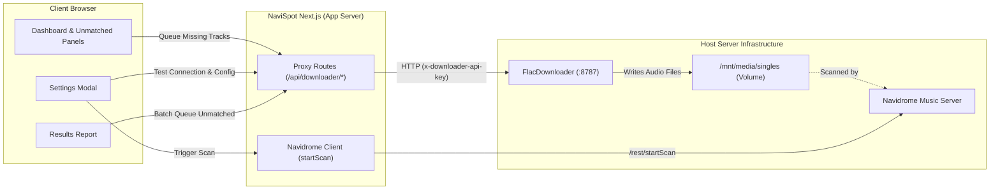

# Feature: Music Downloader Integration (FlacDownloader Bridge)

## Overview
Integrates NaviSpot with the user's self-hosted `music-downloader` (FlacDownloader daemon running on port 8787). Enables automated or 1-click downloading of missing/unmatched tracks during playlist export to Navidrome, downloading and tagging FLAC/MP3 audio directly in `/downloads/complete` (mounted to `/mnt/media/singles`), which Navidrome scans.

## Architecture

### Key Components

1. **Proxy Routes (`/api/downloader/*`)**:
   - `GET /api/downloader/status`: Proxies `GET /web/status` (checks daemon connectivity, active tasks, queue count).
   - `GET /api/downloader/search?q=...&limit=...`: Proxies `GET /web/search` (queries Deezer catalog via FlacDownloader).
   - `POST /api/downloader/queue`: Proxies `POST /web/queue` (enqueues single track by track ID and format).
   - `POST /api/downloader/batch-queue`: Server-side fuzzy matching and batch queueing with configurable concurrency.
   - Prevents browser CORS and mixed-content issues across Docker container networks.

2. **Downloader Context & Client (`lib/downloader/`)**:
   - `storage.ts`: Persists settings in `localStorage` under `navispot_downloader_config` with environment variable fallbacks (`NEXT_PUBLIC_DOWNLOADER_URL`, `NEXT_PUBLIC_DOWNLOADER_API_KEY`).
   - `client.ts`: Supports status checks, Deezer searches, fuzzy candidate matching, and batch queueing.
   - `downloader-context.tsx`: Provides `useDownloader()` hook with reactive state (`config`, `status`, `queueTrack`, `batchQueueTracks`, `triggerNavidromeScan`).

3. **User Interface (`components/`)**:
   - Strictly conforms to `frontend-m3-clean` (zero emojis, Lucide vector icons, accessible tokens).
   - `SettingsModal`: Dedicated "Downloader" tab with daemon endpoint URL, API key, format selector (`flac`, `mp3_320`, `mp3_128`), auto-queue toggle, live connection test with badge, and Navidrome library scan trigger.
   - `UnmatchedSongsPanel`: "Download All Missing (N)" header action and row-level "Download" buttons with live state indicators (Idle -> Queueing -> Queued / Failed).
   - `SongsPanel`: "Queue Missing (N)" action and row actions for tracks that failed matching during export.
   - `ResultsReport`: "Queue Missing in Downloader (N)" batch button and expandable track download action.
   - `Dashboard`: Automated queueing upon export completion when `autoQueueUnmatched` is enabled.

## Implementation Tasks (To-Do List)

- [x] **Task 1: Core Downloader Types, API Client & Server Proxy**
  - [x] Create `types/downloader.ts` with configuration, track, queue, and status models.
  - [x] Create `lib/downloader/storage.ts` for configuration persistence and environment fallbacks.
  - [x] Implement `lib/downloader/client.ts` with status check, Deezer search, queueing, and batch operations.
  - [x] Add `startScan()` and `getScanStatus()` to `lib/navidrome/client.ts`.
  - [x] Implement Next.js server proxy API routes:
    - `app/api/downloader/status/route.ts`
    - `app/api/downloader/search/route.ts`
    - `app/api/downloader/queue/route.ts`
    - `app/api/downloader/batch-queue/route.ts`
  - [x] Add unit tests in `lib/downloader/client.test.ts` and `app/api/downloader/downloader-api.test.ts`.

- [x] **Task 2: UI Integration (Settings, Unmatched Panel, Results Report)**
  - [x] Create `useDownloader()` hook / context in `lib/downloader/downloader-context.tsx`.
  - [x] Mount `DownloaderProvider` inside `AuthProvider` in `app/layout.tsx`.
  - [x] Update `components/Dashboard/SettingsModal.tsx` with a dedicated "Downloader" tab and live connection test.
  - [x] Update `components/Dashboard/UnmatchedSongsPanel.tsx` with individual "Download" buttons and a "Download All Missing" batch action.
  - [x] Update `components/Dashboard/SongsPanel.tsx` with missing track queueing actions.
  - [x] Update `components/ResultsReport/ResultsReport.tsx` with a "Queue Missing Tracks" action.
  - [x] Update `components/Dashboard/Dashboard.tsx` to handle auto-queueing when configured.
  - [x] Enforce Material Design 3 guidelines (zero emojis, Lucide vector icons).
  - [x] Add unit tests in `components/downloader-ui.test.tsx`.

- [x] **Task 3: Verification, End-to-End Build & Merge**
  - [x] Run test suite (`pnpm test` -> 263 / 263 passing).
  - [x] Run linter (`pnpm lint` -> 0 errors).
  - [x] Run Next.js build (`pnpm build` -> static and dynamic routes compiled).
  - [x] Run Docker build (`docker compose build` -> built successfully).
  - [x] Merge to `main` and push to remotes.
